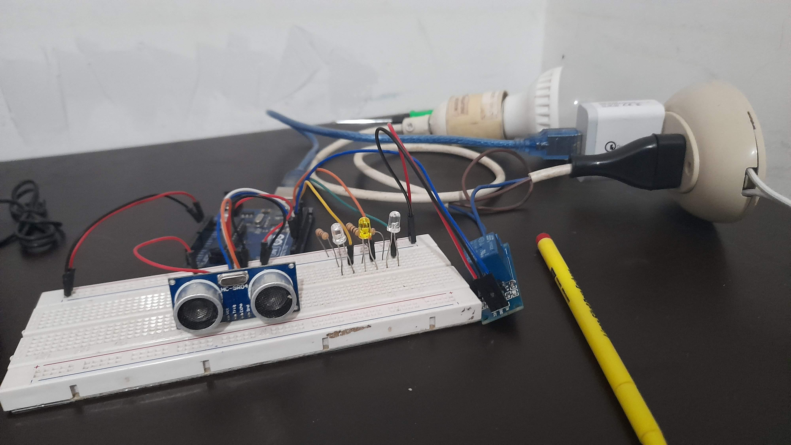

# **Sensor Motor**

> El proyecto Sensor Motor es una solución de automatización del llenado de agua en el A.H. Los ángeles, Rimac, Lima, Perú.

## **Problemática**

> En el A.H. Los ángeles existe la **falta de agua potable** la cual afecta actualmente a **más de 10 familias** que necesitan de este recurso primordial para poder sobrevivir. Por lo tanto, la mayoría de familias llenan su agua mediante **galones, botellas y ollas** y otras familias son afortunadas de tener un **Motor de Agua**, el cual es abastecido desde una pileta a **200 metros de distancia de cada familia**, el llenado de agua con el motor tiene un **estimado de 3 a 4 horas** y necesita de dos personas que los supervisen **una que vigile el tanque de agua** y **otra que vigile el motor**, ya que pueden ocurrir dos cosas:

- El motor absorbe aire y se malogra.
- El agua se desborda del cilindro.

## **Implementos**

> Este proyecto se enfocará en resolver la problemática con el motor de agua. Ahora veamos que implementos se usan para el día a día para empezar a llenar:

- Cilindro
- Manguera de 250 metros
- Tanque de 1100L
- Cable eléctrico de 300 metros
- Motor de Agua

## **Solución**

> Empezaremos con el prototipo usando las siguientes tecnologías:

- Arduino UNO
- Lenguaje de Programación C++
- Leds
- Módulo Relé
- Sensor Ultrasónico HC-SR04
- Foco (Simula ser el Motor de Agua)

Ahora explicaremos el funcionamiento de la solución. El Sensor Ultrasónico será el encargado de medir el nivel del agua dentro el cilindro, si se **encuentra muy cerca del sensor se activara el foco** el cual simula ser el motor de agua y si está a **1.20 metros de distancia** el foco se apaga.

Ahora bien, el Módulo Relé será el encargado de **controlar el flujo de la electricidad** y el cual según la distancia del agua que marca el Sensor Ultrasónico se activara.

Por el lado, de los **leds** serán utilizados como **indicadores del nivel de agua**

Una vez el prototipo haya sido probado procedemos a unir todo en una caja y cambiando el foco y conectarlo con el Motor de Agua. Para ello se tiene una serie de videos que podrán visualizar en la siguiente página web.
